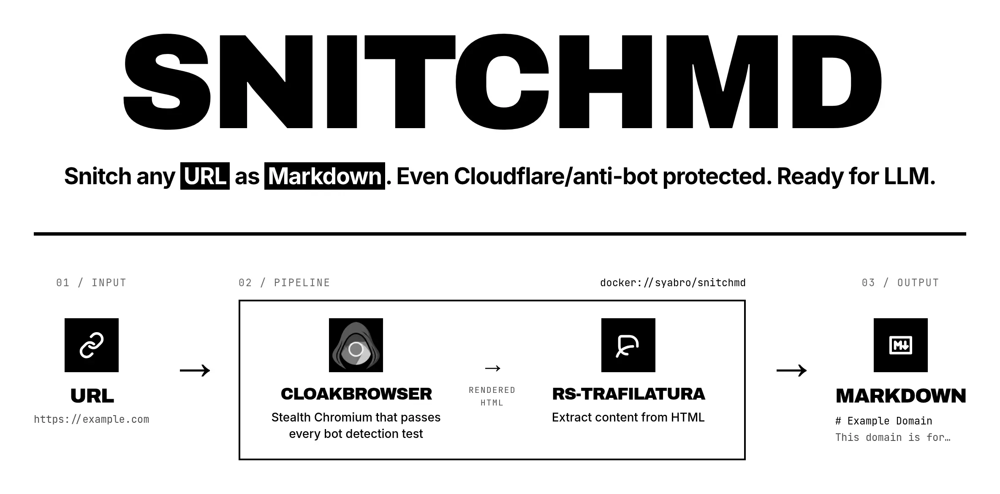

# snitchmd

**Snitch any URL as Markdown. Even Cloudflare/anti-bot protected. Ready for LLM.**

snitchmd is a Docker wrapper around CloakBrowser and rs-trafilatura that turns any URL into clean Markdown, bypassing anti-bot protection.

Use `snitchmd` when:

- you need to feed a page to an LLM and raw HTML is too noisy for the context window;
- a plain `curl` or `fetch` returns an empty shell because the page is rendered by JavaScript;
- the site is gated by Cloudflare, reCAPTCHA, or similar anti-bot checks;
- you want one tool that handles all three without picking a scraping engine.

```bash
snitchmd https://example.com
```

That's the whole job. Markdown to stdout, ready to paste into a prompt, a note, or a RAG pipeline.

## How it works

Under the hood, `snitchmd` chains two existing projects so you don't have to: [CloakBrowser](https://github.com/CloakHQ/CloakBrowser) renders the page past anti-bot checks, and [rs-trafilatura](https://github.com/Murrough-Foley/rs-trafilatura) strips it down to readable Markdown. It's a small Docker wrapper — no new scraper, no new engine.

> _Disclaimer: via [CloakBrowser](https://github.com/CloakHQ/CloakBrowser), snitchmd looks like a real browser — Cloudflare and other detectors don't flag it as a bot ([test results](https://github.com/CloakHQ/CloakBrowser#test-results)). It can't solve the "click all the traffic lights" kind of CAPTCHAs (reCAPTCHA v2, hCaptcha)._

## Install

```bash
curl -fsSL https://raw.githubusercontent.com/syabro/snitchmd/master/install.sh | bash
```

Without install:

```bash
cache_dir="${XDG_CACHE_HOME:-$HOME/.cache}/snitchmd"
mkdir -p "$cache_dir"
docker run --rm -i -v "$cache_dir:/cache" syabro/snitchmd https://example.com
```

Shell alias:

```bash
alias snitchmd='cache_dir="${XDG_CACHE_HOME:-$HOME/.cache}/snitchmd"; mkdir -p "$cache_dir" && docker run --rm -i -v "$cache_dir:/cache" syabro/snitchmd'
```

The image is published as a multi-arch manifest (`linux/amd64` + `linux/arm64`), so Docker pulls the right one for your host automatically.

### Install the skill (Claude Code / Pi / any agent)

Paste this into your agent:

```text
read https://github.com/syabro/snitchmd/blob/master/README.md, install https://raw.githubusercontent.com/syabro/snitchmd/master/skills/snitchmd/SKILL.md, then show me a couple of usage examples.
```

## Uninstall

```bash
curl -fsSL https://raw.githubusercontent.com/syabro/snitchmd/master/install.sh | bash -s -- --uninstall
```

Optional cleanup:

```bash
docker rmi syabro/snitchmd
rm -rf "${XDG_CACHE_HOME:-$HOME/.cache}/snitchmd"
```

## Run

```bash
snitchmd https://example.com
```

Save the Markdown:

```bash
snitchmd https://example.com > page.md
```

## Benchmarks

Raw HTML vs snitchmd output, measured in tokens (tiktoken cl100k_base).

| URL | curl | snitchmd | reduction |
|----------------------------------------------------------------|--------|----------|-----------|
| https://www.cloudflare.com/learning/bots/what-is-a-bot/ | ❌ HTTP 403 | 0.8k | — |
| https://docs.docker.com/engine/install/ | 187.0k | 0.9k | 100% |
| https://en.wikipedia.org/wiki/LLM | 222.7k | 29.7k | 87% |
| https://github.com/anthropics/anthropic-sdk-python | 127.0k | 0.2k | 100% |
| https://corrode.dev/blog/bugs-rust-wont-catch/ | 22.0k | 4.7k | 79% |

Measured 2026-04-29.

## Cache

Each successful fetch is cached on disk by URL + relevant flags. Re-running the same command reads from cache (no browser launch, no extraction).

- Location: `${XDG_CACHE_HOME:-$HOME/.cache}/snitchmd/` on the host (mounted into the container as `/cache`).
- Bypass and refresh a single URL: `snitchmd --no-cache https://example.com`.
- Wipe everything: `rm -rf ~/.cache/snitchmd`.
- Output-only flags (`--json`, `--html-output`) don't affect the cache key, so the same URL is cached once across them.

## Update

```bash
docker pull syabro/snitchmd
```

## Troubleshooting

When the tool itself or its install is broken. Content-shape problems (empty output, missing sections, too much chrome) are pipeline-tuning decisions — see `snitchmd --help`.

| Symptom | Fix |
|---------|-----|
| `snitchmd: command not found` | Re-run the install one-liner; ensure `~/.local/bin` is on `PATH` |
| `Docker is not installed or not in PATH` | Install Docker — https://docs.docker.com/get-docker/ |
| `Docker is installed, but the Docker daemon is not running` | Start Docker (Docker Desktop on Mac/Windows; the Docker service on Linux) |
| `permission denied` on the Docker socket | Add your user to the `docker` group, then re-login (Linux) |
| Image pull fails on first run | Check connectivity; retry with `docker pull syabro/snitchmd` |
| Cache directory not writable | Fix ownership of `${XDG_CACHE_HOME:-$HOME/.cache}/snitchmd`, or delete it to let it recreate |

**Exit codes.** `0` success, `1` runtime error (browser, network — full message on stderr), `2` extraction returned empty content (page was a loading shell, hit a wall, or has no main content).

## JSON output

Use `--json` when you need metadata such as the final URL, page title, extraction quality, and Markdown length:

```bash
snitchmd https://example.com --json
```

## All options

```bash
snitchmd --help
```

## Roadmap

Open ideas live in [`tasks.md`](tasks.md) in [mdtask](https://mdtask.dev/) format. Browse with `pnpx mdtask list` (or any markdown viewer).

## Development

```bash
just build                 # builds linux/amd64 + linux/arm64 locally
docker run --rm snitchmd:local https://example.com
```

`just build` works on both Mac (arm64 native, amd64 via Rosetta) and Linux
PC (amd64 native, arm64 via qemu). If you have a beefier remote machine
sync'd with your tree, `just build-pc-local` ssh's in and builds there.
`just push` publishes a multi-arch manifest to Docker Hub.

## License

MIT
